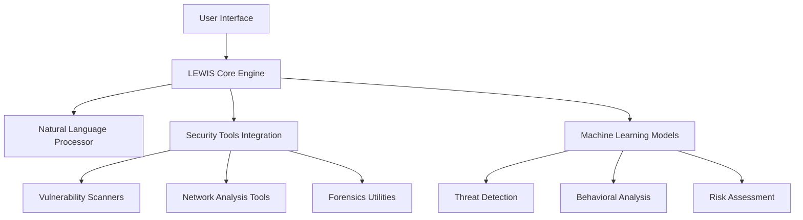

# 🔒 LEWIS: Linux Environment Working Intelligence System

<div align="center">


**A Cybersecurity-Centric AI Assistant Framework**

[](https://arxiv.org)
[](https://orcid.org/0009-0005-2520-2279)
[](LICENSE)
[](https://github.com/yashab-cyber/LEWIS)

---

*Revolutionizing cybersecurity through intelligent automation and AI-powered security operations*

</div>

## 🌟 Overview

**LEWIS** (Linux Environment Working Intelligence System) is a cutting-edge AI-powered cybersecurity assistant framework specifically designed for Linux-based environments including **Kali Linux**, **Termux**, and enterprise servers. By seamlessly integrating machine learning, natural language processing, and intelligent automation, LEWIS transforms traditional cybersecurity workflows into streamlined, intelligent operations.

### 🎯 Vision
To bridge the gap between artificial intelligence and cybersecurity, enabling scalable, intelligent security operations that empower ethical hackers and cybersecurity analysts worldwide.

## ✨ Key Features

<table>
<tr>
<td>

### 🤖 **AI-Powered Assistance**
- Natural language interaction with security tools
- Intelligent command suggestion and execution
- Context-aware security recommendations
- Machine learning-based threat detection

</td>
<td>

### 🔍 **Automated Security Operations**
- Automated vulnerability assessment (VAPT)
- Real-time threat detection and response
- Intelligent security scanning workflows
- Automated penetration testing routines

</td>
</tr>
<tr>
<td>

### 📊 **Professional Reporting**
- Auto-generated security reports
- Compliance certificate generation
- Interactive threat visualization
- Executive summary creation

</td>
<td>

### 🖥️ **Multi-Interface Support**
- Command-line interface (CLI)
- Web-based dashboard
- API endpoints for integration
- Mobile-friendly responsive design

</td>
</tr>
</table>

## 🏗️ Architecture



## 🎯 Target Environments

<div align="center">

| Environment | Support Level | Features |
|-------------|---------------|----------|
| 🐉 **Kali Linux** | ✅ Full | Complete toolkit integration |
| 📱 **Termux (Android)** | ✅ Full | Mobile penetration testing |
| 🖥️ **Ubuntu Server** | ✅ Full | Enterprise security operations |
| 🔧 **Arch Linux** | 🟡 Partial | Community-driven support |
| 🌐 **Cloud Instances** | ✅ Full | AWS, GCP, Azure compatible |

</div>

## 🚀 Getting Started

> **Note**: LEWIS is currently in the research and development phase. The implementation will be available soon.

### Prerequisites
- Linux-based operating system
- Python 3.8+
- Docker (optional)
- Minimum 4GB RAM recommended

### Quick Installation (Coming Soon)
```bash
# Clone the repository
git clone https://github.com/yashab-cyber/LEWIS.git
cd LEWIS

# Install dependencies
pip install -r requirements.txt

# Initialize LEWIS
python lewis.py --init

# Start the system
lewis start
```

## 📚 Documentation Structure

```
📁 LEWIS/
├── 📄 LEWIS_research_paper.pdf     # Complete research documentation
├── 📄 README.md                   # Project overview
├── 📁 docs/                       # Detailed documentation
│   ├── 📄 installation.md
│   ├── 📄 user-guide.md
│   └── 📄 api-reference.md
├── 📁 src/                        # Source code (Coming Soon)
├── 📁 examples/                   # Usage examples
└── 📁 tests/                      # Test suites
```

## 🌐 Use Cases

### For Ethical Hackers
- **Automated reconnaissance** with AI-guided target analysis
- **Intelligent vulnerability discovery** with context-aware scanning
- **Real-time exploitation assistance** with safety checks

### For Security Analysts
- **Threat hunting automation** with ML-powered detection
- **Incident response workflows** with intelligent playbooks
- **Compliance reporting** with automated evidence collection

### For Security Teams
- **Collaborative security operations** with shared intelligence
- **Scalable assessment frameworks** for large environments
- **Continuous monitoring** with adaptive threat models

## 🔬 Research Impact

LEWIS represents a significant advancement in cybersecurity automation, contributing to:

- **Academic Research**: Novel approaches to AI-driven security
- **Industry Applications**: Practical solutions for real-world challenges
- **Open Source Community**: Transparent, collaborative development
- **Educational Resources**: Learning platform for aspiring security professionals

## 👤 Author & Maintainer

<div align="center">

**[Yashab Alam](https://yashabalam.me)**  
*Cybersecurity Researcher & AI Enthusiast*

[](https://orcid.org/0009-0005-2520-2279)
[](https://yashabalam.me)
[](https://github.com/yashab-cyber)

**Zehra Sec** - *Your Security, Our Priority*

</div>

## 📖 Citation

If you use or refer to this work in your research, please cite as:

```bibtex
@misc{alam2024lewis,
  title={LEWIS: Linux Environment Working Intelligence System - A Cybersecurity-Centric AI Assistant Framework},
  author={Alam, Yashab},
  year={2024},
  publisher={GitHub},
  journal={GitHub Repository},
  howpublished={\url{https://github.com/yashab-cyber/LEWIS}},
  note={ORCID: 0009-0005-2520-2279}
}
```

## 🤝 Contributing

We welcome contributions from the cybersecurity and AI communities! Please see our [Contributing Guidelines](CONTRIBUTING.md) for details on how to get involved.

### Ways to Contribute
- 🐛 **Bug Reports**: Help us identify and fix issues
- 💡 **Feature Requests**: Suggest new capabilities
- 📝 **Documentation**: Improve our guides and examples
- 💻 **Code Contributions**: Submit pull requests
- 🧪 **Testing**: Help us ensure reliability and performance

## 📬 Contact & Support

<div align="center">

For questions, suggestions, or collaboration opportunities:

[](mailto:contact@yashabalam.me)
[](https://linkedin.com/in/yashab-alam)
[](https://discord.gg/lewis-community)

</div>

## 📄 License

This project is licensed under the MIT License - see the [LICENSE](LICENSE) file for details.

---

<div align="center">

**⭐ Star this repository if you find LEWIS interesting!**

*Built with ❤️ for the cybersecurity community*


</div>
